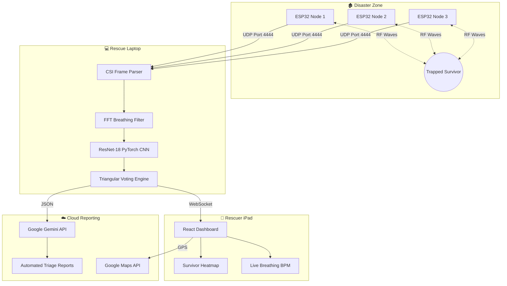

<div align="center">

# 📡 TRI-FI
### AI-Driven RF Disaster Perception Engine

**Transforming standard WiFi signals into a life-saving disaster detection system.**

*Seeing through the rubble — when it matters most.*

---

[](#-hardware--requirements)
[](#-ai--machine-learning)
[](LICENSE)
[]()
[](#-internal-documentation)

</div>

---

## 📋 Table of Contents

1. [What is TRI-FI?](#-what-is-tri-fi)
2. [The Problem](#-the-problem)
3. [The Solution](#-the-solution)
4. [How It Works — Step by Step](#%EF%B8%8F-how-it-works--step-by-step)
5. [The AI & Machine Learning](#-ai--machine-learning)
6. [Hardware Requirements](#-hardware--requirements)
7. [System Architecture](#-system-architecture)
8. [Tech Stack](#%EF%B8%8F-tech-stack)
9. [Quick Start (Developer)](#-quick-start-developer)
10. [Scalability](#-scalability)
11. [Global Impact](#-global-impact--un-sdgs)
12. [Research & References](#-research--references)
13. [Internal Documentation](#-internal-documentation)
14. [Team](#-team)
15. [License](#-license)

---

## 🚀 What is TRI-FI?

**TRI-FI** is an advanced, AI-powered IoT disaster response system with one mission:

> **Locate trapped survivors under rubble using standard 2.4 GHz WiFi signals — for under $50.**

When a building collapses, rescuers race against time. Traditional tools are either too expensive or too limited:
- Ground Penetrating Radar (GPR) costs **$15,000+**
- Thermal cameras are **blocked by concrete**
- Rescue dogs **fatigue quickly** and can't report exact depths

TRI-FI deploys a network of ultra-cheap **$8 ESP32-S3** WiFi chips that detect the micro-movements of a human chest breathing through solid concrete — in real time.

---

## ❗ The Problem

The first 48 hours after a collapse are known as the **"Golden Window"**. Survival rates drop drastically after this period.

| Tool | Limitation |
|---|---|
| 🛰️ Ground-Penetrating Radar (GPR) | $15,000+ per unit — unaffordable for most departments |
| 🌡️ Thermal Cameras (IR) | Cannot penetrate solid concrete or deep drywall |
| 🔊 Acoustic Sensors | Overwhelmed by site noise (generators, machinery, shifting rubble) |
| 🐕 K9 Units | Fatigue quickly; cannot report exact location or depth |

**First responders need a system that is cheap, fast, and penetrates solid debris.**

---

## 💡 The Solution

### Why WiFi?

2.4 GHz WiFi waves pass naturally through non-metallic materials like wood, drywall, and concrete — making them ideal for "seeing" through rubble.

### The Core Concept (Physics Made Simple)

Imagine filling a room with water. When you take a deep breath, your chest expands slightly and creates **tiny ripples**.

WiFi works the same way:
- A router sends signals that bounce off walls, floors, and debris
- A trapped person's chest (expanding ~a few millimeters per breath) **disturbs those bounces**
- TRI-FI captures those disturbances at **20 frames per second**

By placing **three ESP32-S3 nodes in a triangle**, the system captures these signal changes and uses Deep Learning to identify the specific "ripple pattern" of a living, breathing human.

### CSI vs. RSSI — Why It Matters

| | RSSI (Signal Bars) | CSI (TRI-FI) |
|---|---|---|
| **What it gives you** | 1 overall signal score | 64 individual data points per packet |
| **Analogy** | Knowing the *volume* of a song | Reading the *sheet music* of a song |
| **Useful for breathing detection?** | ❌ Too noisy | ✅ Sub-millimeter accuracy |

---

## ⚙️ How It Works — Step by Step

```
[Nodes dropped]  →  [WiFi web created]  →  [CSI extracted]
      ↓
[AI analyzes signal]  →  [FFT confirms breathing]  →  [2+ nodes agree]
      ↓
[Dot appears on rescuer's iPad]  →  [Triage report generated]
```

### Step 1 — Mesh Deployment
Rescuers drop three battery-powered ESP32-S3 nodes in a triangle around the collapsed structure (up to a **15-meter radius**).

### Step 2 — Signal Saturation
Nodes immediately send and receive specialized WiFi packets to each other. **No internet connection required** — they create their own local mesh network.

### Step 3 — CSI Extraction
As packets pass through rubble, the ESP32 hardware bypasses standard network rules to pull raw **Channel State Information** from the physical radio layer.

### Step 4 — AI Processing
Raw signal data is sent via UDP to the rescue laptop. A **Convolutional Neural Network (CNN)** analyzes the data, trained to ignore environmental noise (wind, settling rubble) and detect the rhythmic pattern of human breathing.

### Step 5 — Spectral Filtering
A **Fast Fourier Transform (FFT)** applies a digital bandpass filter of **0.1–0.5 Hz**, isolating signals that repeat 6–30 times per minute — the exact range of human breathing (6–30 BPM).

### Step 6 — Triangular Consensus
Detection is **confirmed only when 2 or more nodes agree**. Their overlapping signals are triangulated (like GPS) to pinpoint a 2D location, rendered as a glowing dot on the rescuer's iPad.

### Step 7 — Cloud Reporting
- **Google Gemini API** generates a human-readable START triage emergency dispatch report from survivor vital data
- **Google Maps API** overlays the heatmap onto satellite imagery for incoming medical teams

---

## 🧠 AI & Machine Learning

TRI-FI uses two complementary algorithms for robust detection:

### 1. Modified ResNet-18 CNN — `custom_presence_model.pth`

| Property | Detail |
|---|---|
| **Architecture** | ResNet-18 (normally used for image recognition, adapted for 1D time-series) |
| **Input** | 64 WiFi subcarriers as a 1D timeline |
| **Output** | Binary classification — `Empty` or `Human Present` |
| **Why ResNet?** | Deep residual connections prevent signal degradation in noisy RF environments |

### 2. FFT Bandpass Filter

| Property | Detail |
|---|---|
| **Method** | Fast Fourier Transform (FFT) |
| **Frequency range** | 0.1–0.5 Hz (= 6–30 BPM) |
| **What it removes** | Fast spikes (falling rocks), slow drift (thermal expansion), DC offset |
| **What remains** | Pure, rhythmic human breathing wave |

---

## 📡 Hardware & Requirements

### Minimum Hardware

| Component | Spec | Cost |
|---|---|---|
| **Sensing Nodes** | 3× ESP32-S3 microcontrollers, flashed with CSI firmware | ~$8 each |
| **Power** | 5V USB power banks (10,000 mAh = ~14 hours per node) | Standard |
| **Rescuer Tracker** | 1× ESP8266 (worn by rescuer as a location beacon) | ~$3 |
| **Edge Server** | Laptop or Raspberry Pi 4, running Python 3.9+ | Standard |

> **Total system cost: Under $50**

### Software Prerequisites

- Python **3.9+**
- Node.js **v18+**

---

## 📊 System Architecture



---

## 🖥️ Tech Stack

| Layer | Technology |
|---|---|
| **Embedded (Nodes)** | C/C++, ESP-IDF framework |
| **Backend (AI Brain)** | Python, PyTorch, NumPy, SciPy, FastAPI, WebSockets |
| **Frontend (Dashboard)** | React.js, Vite, TailwindCSS |
| **Cloud** | Google Gemini API, Google Maps Platform |

---

## 🎬 Quick Start (Developer)

Follow these steps to run TRI-FI locally without any hardware:

### Step 1 — Start the AI Backend

The backend listens for ESP32 CSI data on `0.0.0.0:4444` and streams results via WebSocket at `ws://localhost:8002`.

```bash
cd examples
python rescue_backend.py
```

### Step 2 — Start the Dashboard

Open a **new terminal window**:

```bash
cd ui/react-rescue
npm install
npm run dev
```

> Open your browser to `http://localhost:5173`. The dashboard will connect to the backend WebSocket automatically.

### Step 3 — Connect Hardware *(optional)*

Power on your 3 ESP32-S3 nodes. Ensure their firmware points to the laptop's IP address on port `4444`. The dashboard will automatically display live CSI metrics.

---

## 📈 Scalability

TRI-FI's architecture becomes more accurate with more nodes:

| Configuration | Capability |
|---|---|
| **1 Node** | Detects presence in one directional cone (like a flashlight) |
| **2 Nodes** | Adds depth & distance estimation via cross-referencing |
| **3 Nodes** *(Standard)* | Full 2D triangulation → exact X/Y coordinates + heatmap |
| **N Nodes** | Covers entire buildings; calculates N(N-1) directional links automatically |

---

## 🌍 Global Impact — UN SDGs

| SDG | How TRI-FI Contributes |
|---|---|
| ❤️ **SDG 3** — Good Health & Well-being | Finds victims in minutes instead of days, preventing crush syndrome and dehydration |
| 🏗️ **SDG 9** — Industry, Innovation & Infrastructure | Transforms commodity WiFi chips into architectural radar |
| 🏙️ **SDG 11** — Sustainable Cities & Communities | Gives underfunded fire departments access to $50 radar technology |
| 🌱 **SDG 13** — Climate Action | Provides cheap, disposable rescue tech for climate-driven disasters (landslides, hurricanes) |

---

## 📚 Research & References

TRI-FI's methodology is grounded in peer-reviewed academic research:

1. **DensePose From WiFi** *(CMU)* — Human pose estimation using Wi-Fi CSI amplitude and phase data.
2. **Widar 3.0** — Zero-effort cross-domain gesture recognition via Wi-Fi signals.
3. **SpotFi** *(Stanford)* — Decimeter-level localization using Wi-Fi; foundation for our multipath extraction logic.

---

## 📖 Internal Documentation

| Document | Description |
|---|---|
| [Methodology Sheet](docs/trifi_methodology_sheet.md) | Mathematical breakdown of FFT algorithms and Triangular Consensus |
| [Firmware Build Guide](firmware/README.md) | Flashing the ESP32-S3 CSI extraction toolchain |
| [Frontend Docs](ui/react-rescue/README.md) | React component structure, WebSocket handlers, and UI configuration |
| [Model Training Guide](examples/README.md) | Capturing custom CSI datasets and retraining the PyTorch model |
| [Survivor Manual](SURVIVOR_MANUAL.md) | Field operations guide for deploying TRI-FI at a disaster site |

---

## 🤝 Team

> *Prins Kanyal,*
> *Vandana Bhandari,*
> *Aadarsh Dimri,*
> *Yuvraj Kabadwal*

---

## 📜 License

This project is licensed under the **MIT License** — see [LICENSE](LICENSE) for details.

---

<div align="center">
  <i>Built with ❤️ to save lives.</i>
</div>
