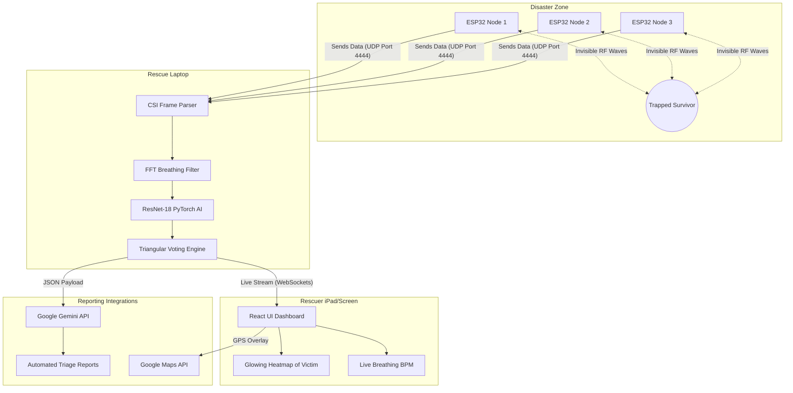

<div align="center">
  <h1>📡 TRI-FI: AI-Driven RF Disaster Perception Engine</h1>
  <p><strong>Transforming standard WiFi signals into a life-saving disaster perception engine.</strong></p>
  <p><i>Seeing through the rubble when it matters most.</i></p>

  [](#-hardware--infrastructure-requirements)
  [](#-deep-dive-the-ai--machine-learning-approach)
  [](#-license)
  []()
  [](#-guides--internal-documentation)
</div>

<hr>

## 🚀 Welcome to TRI-FI

**TRI-FI** is an advanced, AI-powered IoT disaster response system. Its goal is simple: **Locate trapped survivors under rubble using standard 2.4 GHz WiFi signals.** 

When a building collapses, rescuers are racing against the clock. They need to know *exactly* where to dig. Traditional tools like Ground Penetrating Radar (GPR) are incredibly expensive, and rescue dogs fatigue quickly. TRI-FI solves this by deploying a network of ultra-cheap ($8) ESP32-S3 WiFi chips that can "see" the micro-movements of a human breathing through solid concrete.

---

## ❗ The Problem We Are Solving

In search and rescue operations, the first 48 hours are known as the **"Golden Window"**. After this period, survival rates drop drastically. Rescuers currently rely on:

1. **Ground-Penetrating Radar (GPR):** Highly accurate, but costs $15,000+ per unit. Most local fire departments cannot afford them.
2. **Thermal Cameras (IR):** Completely useless if the victim is buried under deep concrete or drywall, as thermal radiation does not penetrate solid mass well.
3. **Acoustic Sensors:** Listen for tapping or breathing, but disaster sites are incredibly noisy (generators, heavy machinery, shifting rubble), causing false positives.
4. **K9 Units (Rescue Dogs):** Highly effective but can only work for short periods and cannot communicate exact depths or vitals.

**The Bottom Line:** First responders need a system that is cheap enough to deploy everywhere, fast enough to work instantly, and capable of penetrating solid debris.

---

## 💡 The Solution: WiFi as a Radar

TRI-FI leverages the invisible radio waves already omnipresent in our environment. 

### Why WiFi? 
2.4 GHz WiFi waves pass naturally through non-metallic obstructions like wood, drywall, and concrete. 

### The Core Concept (Physics Made Simple)
Imagine a room filled with water, and you are standing still in the center. If you take a deep breath, your chest expands slightly, creating tiny ripples in the water. 

WiFi works the same way. When a router sends a WiFi signal, it bounces off walls, floors, and debris before reaching the receiver. This creates a complex "web" of invisible signals. When a human trapped under rubble breathes, their chest cavity expands by merely a few millimeters. This tiny movement alters how the WiFi waves bounce. 

By strategically placing **three $8 ESP32-S3 nodes** in a triangle over a collapsed zone, TRI-FI captures these minute signal disturbances at 20 frames per second. We then use Deep Learning (AI) to recognize the specific "ripple" pattern of human breathing and pinpoint the survivor. Total system cost? **Under $50.**

---

## 🌟 Why This Is Innovative: CSI vs. RSSI

Most people know WiFi signal strength by the "bars" on their phone. This is called **RSSI (Received Signal Strength Indicator)**. RSSI is like knowing the overall volume of a song. It's too noisy to detect breathing.

TRI-FI uses **CSI (Channel State Information)**. CSI is like having the sheet music for the song, showing the exact volume and pitch of every single instrument. 
Instead of one general signal score, CSI gives us 64 distinct data points (subcarriers) for *every single WiFi packet*. This unlocks radar-like, sub-millimeter tracking capabilities on an $8 microchip.

---

## ⚙️ How It Works: The Step-by-Step Pipeline

Here is exactly what happens when rescuers arrive at a disaster site:

### 1. Mesh Deployment (The Setup)
Rescuers drop three battery-powered ESP32-S3 chips in a triangle around the collapsed structure (up to a 15-meter radius). 

### 2. Signal Saturation (The Invisible Web)
The nodes immediately begin blasting and receiving specialized WiFi packets to each other. They do not need an internet connection; they create their own local, localized network. 

### 3. CSI Extraction (Reading the Matrix)
As the packets travel through the rubble, the ESP32 hardware bypasses standard network rules to extract the raw Channel State Information (CSI) from the physical radio layer. 

### 4. AI Processing (Finding the Human)
These raw signal numbers are sent via UDP to a local laptop (the Edge Compute Host). Our AI—a Convolutional Neural Network—analyzes the numbers. It has been trained to ignore the random signal bouncing caused by wind or settling rubble, and specifically look for the rhythmic pattern of a human body.

### 5. Spectral Filtering (Confirming Life)
To be absolutely sure it's a human, the system applies a math trick called a Fast Fourier Transform (FFT). It isolates signals that repeat exactly 6 to 30 times a minute—the exact rate of human breathing.

### 6. Triangular Consensus (Locating the Target)
If Node 1 thinks there is a human, it waits for Node 2 or Node 3 to agree. If at least 2 nodes confirm the breathing pattern, the system calculates the intersection of their signals (like GPS triangulation) and places a glowing red dot on the rescuer's iPad screen.

### 7. Google Cloud Integrations (Reporting & Mapping)
To augment the core offline system, the backend pushes sanitized vital sign data to the **Google Gemini API** to automatically generate human-readable START triage emergency dispatch reports. The React dashboard overlays the localized survivor heatmap onto **Google Maps Platform** satellite imagery to help incoming medical teams navigate the debris field.

---

## 🧠 Deep Dive: The AI & Machine Learning Approach

Our software doesn't just guess; it uses state-of-the-art machine learning algorithms tailored for time-series signal data:

1. **Modified ResNet-18 (CNN) - `custom_presence_model.pth`:** 
   - *What it is:* ResNet-18 is a famous AI architecture usually used for recognizing images. 
   - *How we use it:* We modified it to look at time instead of pictures. We feed the 64 WiFi subcarriers into the AI as a 1D timeline. The binary CSI presence model classifies whether the area is "Empty" or has "Human Presence."
   
2. **Fast Fourier Transform (FFT) Bandpass:**
   - *What it is:* A math formula that separates mixed signals into their individual repeating frequencies.
   - *How we use it:* We apply a strict digital bandpass filter of **0.1–0.5 Hz**. Any movement faster (like a falling rock) or slower is deleted. What's left is the pure, rhythmic wave of human breathing (6-30 BPM).

---

## 📡 Hardware & Infrastructure Requirements

To build and run TRI-FI, the hardware is incredibly accessible:

- **Sensing Nodes:** 3x ESP32-S3 microcontrollers (Approx $8 each). Flashed with our custom C++ firmware based on ESP-IDF to unlock CSI promiscuous mode.
- **Power:** Standard 5V USB power banks. A 10,000mAh battery powers a node for ~14 hours.
- **Rescuer Tracker:** An ESP8266 chip carried by the rescuer. It acts as a beacon so the dashboard can show where the rescuer is walking relative to the trapped victim.
- **Edge Server:** Any standard rugged laptop or Raspberry Pi 4 running Python 3.9+.

---

## 📊 System Architecture Diagram

*A visual representation of the data flow from the rubble to the rescuer's screen.*



---

## 🖥️ The Tech Stack

- **Embedded Systems (The Nodes):** C/C++, ESP-IDF framework.
- **Backend Server (The Brain):** Python, PyTorch (for AI), NumPy/SciPy (for complex math), FastAPI & WebSockets (to stream data instantly).
- **Frontend Dashboard (The Screen):** React.js, Vite (for speed), TailwindCSS (for a dark, high-contrast, "glassmorphism" UI that is highly legible in bright sun).
- **Google Cloud Platform:** Google Gemini API (for LLM-based triage report generation) and Google Maps API (for satellite heatmap overlays).

---

## 🎬 How to Run the Project (Developer Quick Start)

Want to test TRI-FI yourself? Follow these exact steps to run the software pipeline locally:

### Prerequisites
- Python 3.9+ installed on your computer.
- Node.js v18+ installed.

### Step 1: Start the AI Backend
This script acts as the core engine. It listens for the ESP32 CSI UDP packets on `0.0.0.0:4444` and exposes a WebSocket feed at `ws://localhost:8002` with survivor probabilities and RF heatmaps.
```bash
# Navigate to the backend examples folder
cd examples

# Run the backend server
python rescue_backend.py
```

### Step 2: Start the Rescuer Dashboard
Open a new terminal window. This runs the visual map and UI interface you see on screen.
```bash
# Navigate to the frontend UI folder
cd ui/react-rescue

# Install necessary JavaScript libraries
npm install

# Start the dashboard
npm run dev
```
*(Open your browser to `http://localhost:5173`. You will see the tactical interface load. It connects to the backend WebSocket automatically).*

### Step 3: Connect Hardware
Power on your 3 ESP32-S3 chips. Ensure their firmware is configured to send UDP packets to the IP address of the laptop running Step 1 on port `4444`. The dashboard will automatically light up with their live CSI metrics.


---

## 📈 Scalability: From 1 Node to an Entire Building

TRI-FI uses a modular mathematical architecture that gets exponentially better the more nodes you add:
- **1 Node:** Acts like a flashlight. It can detect breathing and presence in one directional cone.
- **2 Nodes:** Acts like two eyes. It can detect depth, distance, and cross-reference signals.
- **3 Nodes (Standard Setup):** Creates a "Triangle of Consensus." Calculates exact 2D coordinates (X, Y) using a Center of Mass algorithm to build a heatmap.
- **N Nodes:** You can drop 10, 20, or 50 nodes over a massive collapsed apartment complex. The system calculates $N(N-1)$ directional links and automatically maps the entire grid dynamically.

---

## 🌍 Global Impact (UN SDG Alignment)

We didn't just build this as a hackathon tech demo; we built it to solve global humanitarian crises, perfectly aligning with the United Nations Sustainable Development Goals:

- **❤️ SDG 3 (Good Health and Well-being):** By finding victims in minutes instead of days, we directly prevent crush syndrome, dehydration, and save lives.
- **🏗️ SDG 9 (Industry, Innovation and Infrastructure):** We are taking everyday consumer WiFi infrastructure and hacking it into advanced architectural radar.
- **🏙️ SDG 11 (Sustainable Cities and Communities):** We give underfunded fire departments in developing nations access to $50 radar tech, ensuring all cities can be resilient against earthquakes.
- **🌱 SDG 13 (Climate Action):** As climate change increases the severity of natural disasters (landslides, hurricanes), cheap, disposable rescue tech is vital for immediate adaptation.

---

## 📚 Research & References

TRI-FI's core methodology is built upon peer-reviewed academic literature in the field of RF sensing:
1. **DensePose From WiFi (CMU):** Groundbreaking research demonstrating human pose estimation using standard Wi-Fi CSI amplitude and phase.
2. **Wi-Fi as a Radar (Widar 3.0):** Explores zero-effort cross-domain gesture recognition using Wi-Fi signals.
3. **SpotFi (Stanford):** Decimeter level localization using Wi-Fi, providing the foundation for our multipath extraction logic.

---

## 📖 Guides & Internal Documentation

To deeply understand or expand upon the TRI-FI architecture, consult our internal wikis:
- [System Methodology Sheet](docs/trifi_methodology_sheet.md): Comprehensive mathematical breakdown of our FFT algorithms and Triangular Consensus.
- [Firmware Build Guide](firmware/README.md): Instructions for flashing the custom ESP32-S3 CSI extraction toolchain.
- [React Frontend Documentation](ui/react-rescue/README.md): Component structure, WebSocket handlers, and glassmorphic UI configuration.
- [Model Training Guide](examples/README.md): How to capture custom CSI datasets and retrain the PyTorch model for novel environments.

---

## 🤝 The Team
- *(Add Team Members Here)*

## 📜 License
This project is licensed under the MIT License - see the [LICENSE](LICENSE) file for details.

<br>

<div align="center">
  <i>Built with ❤️ to save lives.</i>
</div>
