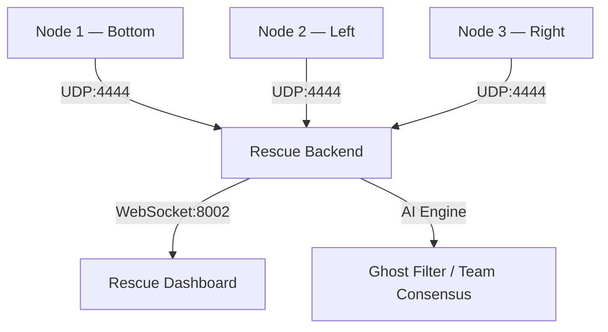

<div align="center">

# 🆘 TRI-FI — Field Survivor Manual

**Triangular Survivor Detection System**

*Operational guide for deploying TRI-FI at a disaster site.*

---

[]()
[]()
[]()

</div>

---

## 📋 Table of Contents

1. [System Overview](#-system-overview)
2. [How the System Works](#-how-the-system-works)
3. [Deploy & Run — Step by Step](#-deploy--run--step-by-step)
4. [Reading the Dashboard](#-reading-the-dashboard)
5. [Troubleshooting](#-troubleshooting)
6. [Quick Reference](#-quick-reference)

---

## 🔭 System Overview

TRI-FI uses **three ESP32 nodes** arranged in a **Tactical Triangle** to detect trapped survivors. Each node sends raw CSI (Channel State Information) and vitals data to a central Python backend over UDP.



> **Key principle:** Detection only triggers when **multiple nodes agree simultaneously** — preventing false alarms from a single noisy sensor.

---

## 🧠 How the System Works

TRI-FI has three layered detection mechanisms. Each layer adds confidence before an alert is triggered.

---

### Layer 1 — Ghost Filter (Differential RSSI)

**Purpose:** Eliminate false positives from static objects (furniture, metal, rubble).

| Step | What Happens |
|---|---|
| Startup | System records **8 seconds** of ambient signal as the baseline |
| During scan | Only **signal jumps of +5 dBm or more** are flagged as movement |
| Result | Static objects (laptops, rebar, walls) are ignored automatically |

> ✅ The Ghost Filter ensures TRI-FI reacts to **living bodies** — not environmental clutter.

---

### Layer 2 — Team Consensus (Multi-Node Fusion)

**Purpose:** Prevent a single bad node from triggering a false alert.

| Rule | Detail |
|---|---|
| Minimum agreement | At least **2 of 3 nodes** must detect the same signal change simultaneously |
| Outside person test | If you stand next to only Node 2, the other nodes see nothing → system correctly reports **NO SURVIVOR** |
| Current mode | **V10 Strict Mode** — Triple Consensus is enforced by default |

> ✅ Consensus ensures that **only a survivor inside the triangle** can trigger an alert.

---

### Layer 3 — Sign-of-Life (BPM & Motion Boost)

**Purpose:** Confirm a human signal even when CSI is partially obstructed.

| Signal | Threshold | Confidence Boost |
|---|---|---|
| 🫁 Breathing (BPM) | 8–35 BPM | +50% |
| 🏃 Motion Energy | High amplitude movement | +45% |

> ✅ Sign-of-Life catches weak signals from deeply buried survivors who can barely move.

---

## 🚀 Deploy & Run — Step by Step

### ⬛ Step 1 — Provision the Nodes

Each ESP32 node needs a unique ID before deployment. Run this from the `firmware/esp32-csi-node` directory for each node:

```powershell
# Set the node ID (1, 2, or 3), your laptop's IP, and the COM port
python provision.py --port COM<X> --node-id 1 --target-ip <YOUR_IP> --target-port 4444
```

Replace:
- `COM<X>` → the serial port the node is connected to (e.g. `COM3`)
- `<YOUR_IP>` → the IP address of the rescue laptop (e.g. `192.168.1.50`)
- `--node-id` → `1`, `2`, or `3` for each respective node

---

### ⬛ Step 2 — Start the Backend & Calibrate

> [!IMPORTANT]
> After starting the backend, **immediately leave the triangle**. The system will spend 8 seconds learning the empty room's baseline. If you stay inside, your body will become the "noise floor" and detection will fail.

```powershell
python rescue_backend.py
```

Wait for the **8-second Noise Analysis Countdown** to complete in the terminal. Once done, the system is calibrated and ready.

---

### ⬛ Step 3 — Open the Tactical Dashboard

Open `ui/rescue.html` in your browser (or the React app if running the full stack).

The dashboard will automatically connect to the backend via WebSocket on port `8002`.

---

## 📟 Reading the Dashboard

| Indicator | Meaning |
|---|---|
| 🟢 **Solid Green Dot** | Survivor confirmed inside the triangle |
| 🔵 **Pulsing Ring** | Detection is active and Team Consensus is met |
| ⚪ **No indicator** | Area is empty, calibrating, or below consensus threshold |

---

## 🔧 Troubleshooting

> [!TIP]
> **Flickering or Unstable Detection?**
> Room noise is too high. Stay completely still inside the **center of the triangle** for 8 seconds. The EMA (Exponential Moving Average) will stabilize the baseline automatically.

> [!WARNING]
> **No Signal From a Node?**
> Check that the node's `target-ip` matches your laptop's current local IP. Laptop IP can change if you reconnect to a network. Re-provision if necessary.

> [!IMPORTANT]
> **Running V10 Strict Mode**
> Triple Consensus is enforced by default. A single node detecting movement will **never** trigger an alert on its own. This is intentional — it eliminates false alarms in noisy disaster environments.

---

## ⚡ Quick Reference

```
STARTUP SEQUENCE
────────────────────────────────────────
1. Provision all 3 nodes (unique IDs: 1, 2, 3)
2. Place nodes in triangle around target zone
3. Run: python rescue_backend.py
4. EXIT the triangle immediately
5. Wait 8 seconds for calibration
6. Open dashboard → ui/rescue.html
7. Monitor for green dot / pulsing ring

ALERT MEANS:
  ✅ Green Dot    → Survivor inside triangle
  ✅ Pulsing Ring → Multi-node consensus active

DETECTION THRESHOLDS:
  Signal jump   : +5 dBm above baseline
  Breathing BPM : 8–35 BPM
  Consensus     : ≥2 of 3 nodes must agree
```

---

<div align="center">
  <i>Every second counts. Stay calibrated. Trust the consensus.</i>
</div>
