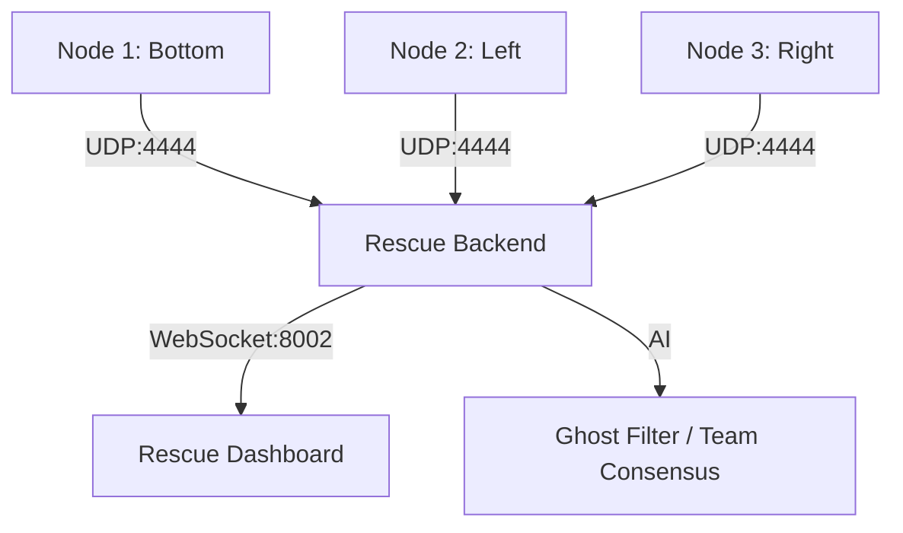

# 📐 Trifi: Triangular Survivor Detection System

This project implements a high-accuracy presence detection system using **CSI (Channel State Information)** from three ESP32 nodes. It is designed to find trapped survivors inside a triangular zone while ignoring background noise and people standing outside the perimeter.

## 🏗 System Architecture

The system uses 3 nodes (ESP32) set up as a **Tactical Triangle**. Each node sends raw CSI and Vitals data to a central Python backend over UDP.



## 🛡 Key Features

### 1. The Ghost Filter (Differential RSSI)
Instead of absolute signal levels, the system uses **Differential Analysis**. 
*   **How it works**: It performs **8 seconds of Noise Analysis** to learn your room's baseline. 
*   **Result**: It ignores static metal objects (like your laptop) and only detects **Signal Jumps** (+5dBm) caused by a human body.

### 2. Team Consensus (Fusion)
To prevent one node from creating a false alarm, the system uses a **Consensus Multiplier**.
*   **Rule**: At least two nodes MUST see the signal change at the same time to trigger an alert.
*   **Benefit**: If you stand right next to Node 2 (Outside), the other nodes see nothing, and the system correctly says **NO SURVIVOR**.

### 3. Sign-of-Life (BPM & Motion)
If the CSI signal is weak, the system looks for **Vitals**.
*   **Breathing**: Valid BPM (8-35) adds a 50% confidence boost.
*   **Motion**: High-energy motion adds a 45% confidence boost.

## 🚀 How to Run

### Step 1: Provision
Each node must have a unique ID. Run this from `firmware/esp32-csi-node`:
```powershell
# Set Node ID to 1, 2, or 3
python provision.py --port COM<X> --node-id 1 --target-ip <YOUR_IP> --target-port 4444
```

### Step 2: The Calibration Start
Start the backend and **IMMEDIATELY leave the triangle.**
```powershell
python rescue_backend.py
```
Wait for the **8-second Noise Analysis Countdown** to finish. The system is now calibrated to your room.

### Step 3: Tactical Dashboard
Open `ui/rescue.html` in your browser. 
*   **Green Dot**: Survivor confirmed inside.
*   **Fulsing Ring**: Detection is active and "Team Consensus" is met.

## 🔧 Troubleshooting

> [!TIP]
> **Uneven Detection?**
> If the dashboard flickers, it means the room noise is high. Stay still for **8 seconds** inside the center to let the **EMA (Moving Average)** stabilize the detection.

> [!IMPORTANT]
> The system is currently running **V10 Strict Mode** which implements the **Triple Consensus** by default. Detection only triggers if the survivor is confirmed by multiple signal paths.
